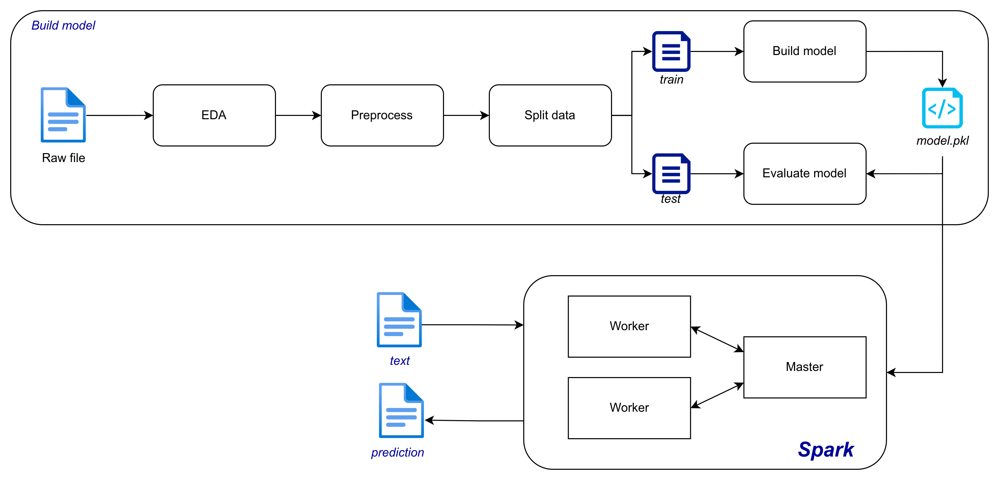

# Sentiment Analysis with Spark

This is our project at school to solve sentiment analysis problem. Here we pose a problem that we want to enhance the speed of inferencing big data files containing sentiment sentences. To reach that goal, after training the models, we use Spark to help us inference big data files.

 </img>

# How to use

## This project uses XAMPP, PHP for web application and PYTHON for API of predictions of AI models.
To run this project, please follow the following steps:

1. Move the directory `web` to the `htdocs` directory of XAMPP

2. Install necessary python packages (we forgot to add requirements.txt file so please install any package that causes error.

3. Download [VnCoreNLP](https://github.com/vncorenlp/VnCoreNLP)

4. Change the variable $AISERVER in the connection.php if necessary (if you change address of the host of FastAPI) 

5. Access to homepage.php in your browser (when you turn on XAMPP) and try the web.

## Here, we just use spark to have a demo for big data process.

1. Install Spark
2. Run
```
spark-submit --master <master> test_spark.py
```
